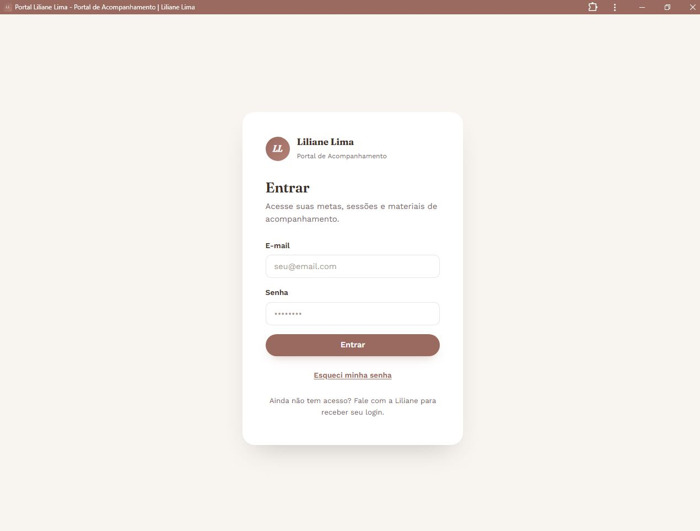
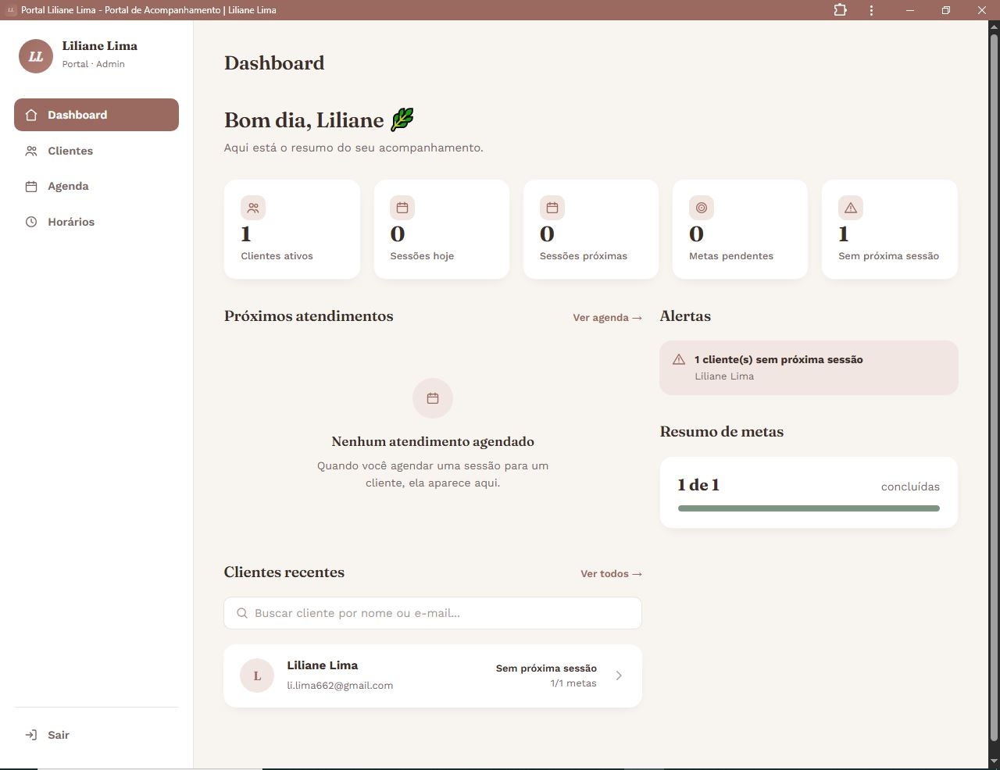
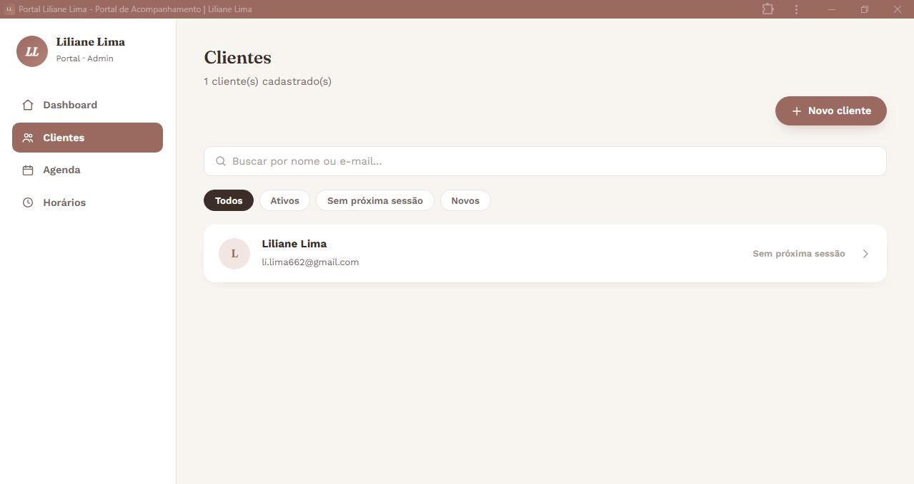
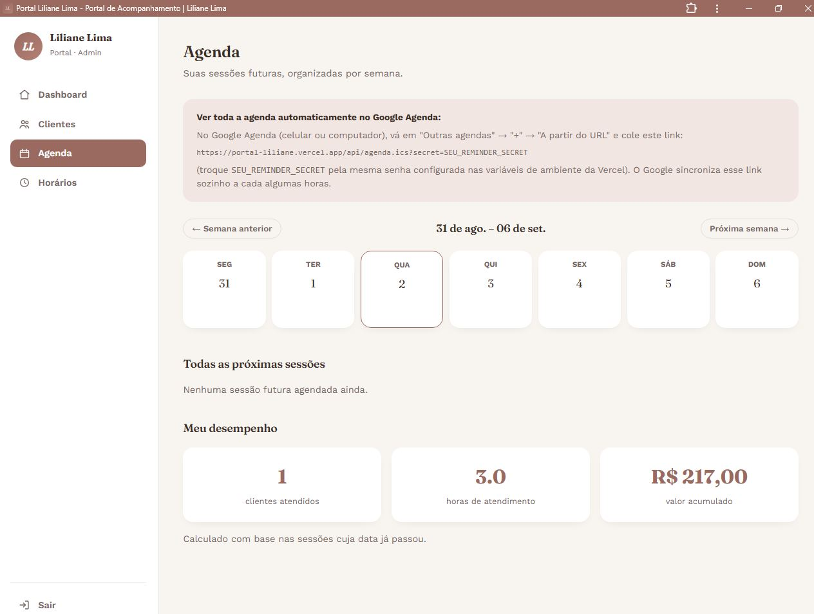
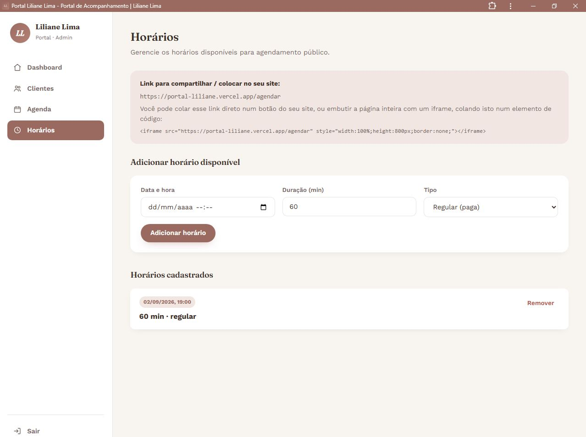
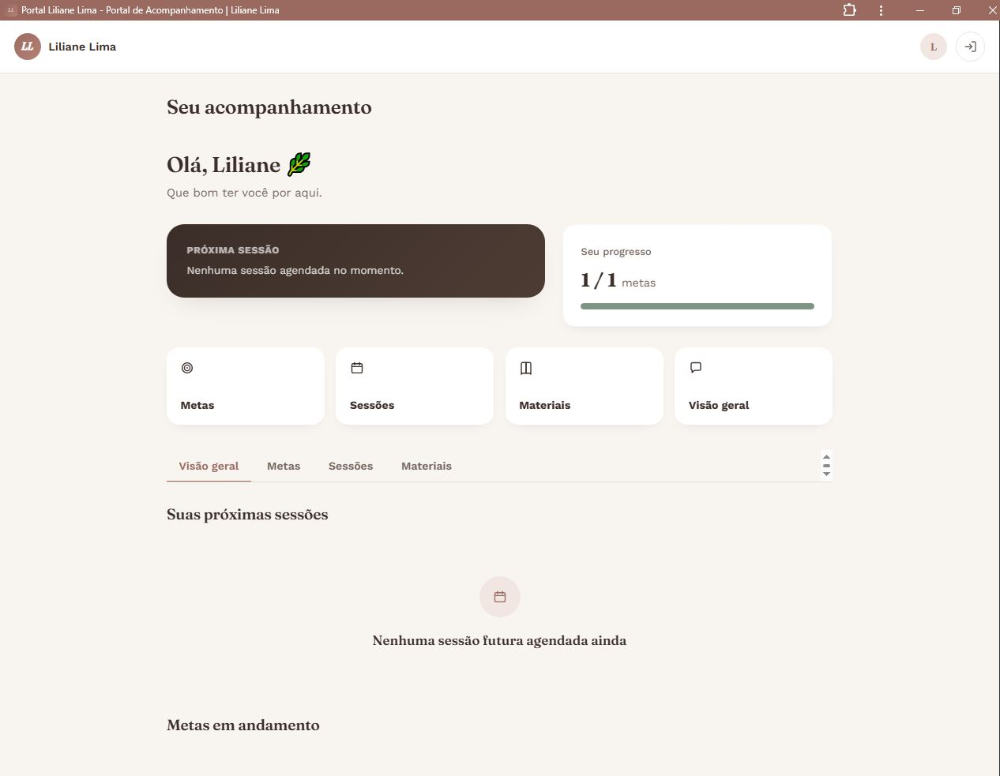
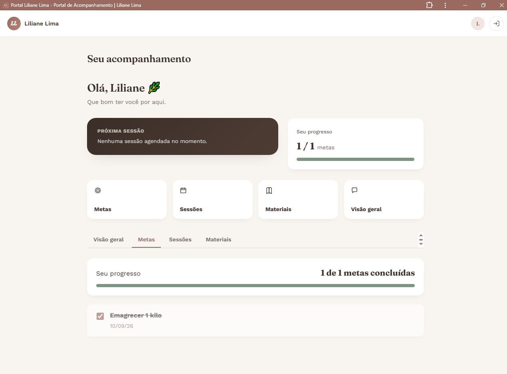
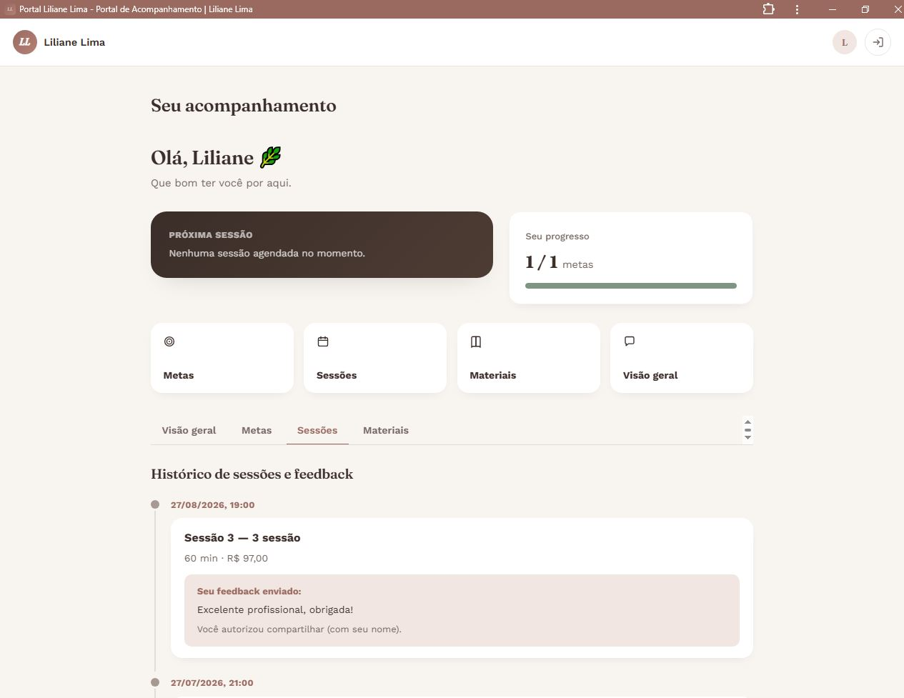

# Portal de Acompanhamento — Liliane Lima

Sistema para cadastrar clientes, atribuir metas, materiais e sessões,
registrar feedback, mandar lembretes e acompanhar seu desempenho — tudo
com o cliente acessando pelo próprio login. React + TypeScript + Supabase
+ Gmail, todos gratuitos.

## Capturas de tela

**Área da Liliane (admin)**

| Login | Dashboard | Clientes |
|---|---|---|
|  |  |  |

| Agenda | Horários |
|---|---|
|  |  |

**Área do cliente**

| Visão geral | Metas | Sessões |
|---|---|---|
|  |  |  |

## O que você precisa (tudo grátis)

1. Conta no [Supabase](https://supabase.com)
2. Conta no [GitHub](https://github.com)
3. Conta na [Vercel](https://vercel.com)
4. Uma **Senha de app** do Gmail de `seu-email-aqui@gmail.com` (Passo 3)
5. Nenhum cadastro extra para os lembretes — usamos o GitHub Actions, com a conta que você já tem (Passo 6)

---

## PASSO 1 — Projeto no Supabase

1. Crie o projeto em supabase.com.
2. **SQL Editor → New query** → cole todo o `supabase/schema.sql` → **Run**.
3. Em **Project Settings → API**, anote:
   - **Project URL**
   - **anon public key**
   - **service_role key** (⚠️ essa é secreta — nunca cole no código do site, só nas variáveis de ambiente da Vercel)

## PASSO 2 — Seu login de admin

1. **Authentication → Users → Add user** → seu e-mail e senha.
2. No SQL Editor:
   ```sql
   update public.profiles set is_admin = true where email = 'seu-email-aqui@gmail.com';
   ```
3. Cadastrar clientes agora é feito **direto pelo site** (menu "Clientes" → "+ Novo cliente") — não precisa criar pelo painel do Supabase.

## PASSO 2.1 — Configurar o link de "esqueci minha senha" (importante!)

Por padrão, o Supabase vem configurado apontando para `localhost` (o
computador de quem criou o projeto) — por isso o link de redefinição de
senha não funciona até você trocar pelo endereço real do seu site:

1. No painel do Supabase, vá em **Authentication → URL Configuration**.
2. Em **Site URL**, apague o que estiver lá e coloque o endereço do seu
   site publicado na Vercel (ex: `https://portal-liliane.vercel.app`).
3. Em **Redirect URLs**, adicione essa mesma URL seguida de
   `/redefinir-senha` (ex: `https://portal-liliane.vercel.app/redefinir-senha`).
4. Salve. Sem isso, o link do e-mail sempre vai tentar abrir `localhost`
   e parecer "quebrado".

## PASSO 2.2 — Configurar SMTP próprio (obrigatório para o e-mail funcionar)

O Supabase, no modo padrão (sem essa configuração), só envia **2 e-mails
por hora** e só entrega para endereços cadastrados como "membros da
equipe" do seu projeto — ou seja, **não envia para seus clientes de
jeito nenhum** enquanto isso não for configurado. A solução é usar sua
própria conta de e-mail para o envio, reaproveitando a Senha de App do
Gmail que você já criou no Passo 3:

1. No painel do Supabase: **Authentication → Emails** → **SMTP Settings** → ative **Enable Custom SMTP**.
2. Preencha:
   - **Sender email**: `seu-email-aqui@gmail.com`
   - **Sender name**: `Seu Nome`
   - **Host**: `smtp.gmail.com`
   - **Port**: `587`
   - **Username**: `seu-email-aqui@gmail.com`
   - **Password**: a mesma Senha de App do Gmail (16 letras) do Passo 3
3. Salve.

Sem este passo, o botão "Esqueci minha senha" não vai funcionar para os
seus clientes — só para e-mails que você mesma adicionar como membros da
equipe do projeto no Supabase (o que não faz sentido para clientes reais).

## PASSO 3 — Senha de App do Gmail

1. Em **myaccount.google.com/security**, logada como `seu-email-aqui@gmail.com`, ative a **Verificação em duas etapas**.
2. Vá em **myaccount.google.com/apppasswords**, crie uma senha de app (nome sugerido "Portal Clientes"), copie o código de 16 letras.

## PASSO 4 — GitHub

Suba os arquivos desta pasta para um repositório (exceto `node_modules` e `dist`, já ignorados).

## PASSO 5 — Vercel

1. **Add New → Project**, selecione o repositório.
2. Em **Environment Variables**, adicione:
   - `VITE_SUPABASE_URL`
   - `VITE_SUPABASE_ANON_KEY`
   - `SUPABASE_SERVICE_ROLE_KEY`
   - `GMAIL_USER` → `seu-email-aqui@gmail.com`
   - `GMAIL_APP_PASSWORD` → código do Passo 3
   - `REMINDER_SECRET` → invente uma senha qualquer (ex: uma frase aleatória sem espaços)
3. **Deploy**.

## PASSO 6 — Lembrete automático de sessão (1h antes)

A Vercel, no plano grátis, só permite tarefas automáticas **1x por dia** —
não dá para checar "a cada 10 minutos" só com ela. Por isso, usamos o
**GitHub Actions** (que você já tem, pela mesma conta usada para subir o
código) para "cutucar" o sistema a cada 15 minutos — sem precisar criar
conta em mais nenhum lugar.

1. No repositório do GitHub, vá em **Settings → Secrets and variables → Actions**.
2. Clique em **New repository secret** e crie estes dois, um de cada vez:
   - Nome: `SITE_URL` — Valor: o endereço do seu site publicado, **sem barra no final** (ex: `https://portal-liliane.vercel.app`)
   - Nome: `REMINDER_SECRET` — Valor: a mesma senha que você colocou como `REMINDER_SECRET` nas variáveis de ambiente da Vercel (Passo 5)
3. Pronto — o arquivo `.github/workflows/lembretes.yml` (já vem dentro desta pasta) faz o resto sozinho, rodando a cada 15 minutos automaticamente assim que você subir esses arquivos para o GitHub.
4. Para conferir se está funcionando: no repositório, vá na aba **Actions** → clique em "Lembrete de sessão (1h antes)" → você pode até clicar em **Run workflow** para testar na hora, sem esperar os 15 minutos.

Se quiser, você pode ajustar a frequência: no arquivo `.github/workflows/lembretes.yml`,
troque `*/15 * * * *` por `*/10 * * * *` (a cada 10 min) — evite deixar
mais frequente que isso, pois o GitHub limita o uso de Actions em contas gratuitas.

---

## O que tem nesta versão

- **Termo de privacidade com aceite obrigatório**: no primeiro acesso, o
  cliente vê um resumo claro do que é guardado sobre ele (dados de
  cadastro, sessões, metas, feedback) e precisa clicar em "Li e aceito"
  antes de acessar qualquer coisa no portal. Fica registrada a data e
  hora exata do aceite, visível para você na página do cliente — isso
  serve como comprovante de consentimento (importante para conformidade
  com a LGPD, já que dados de acompanhamento terapêutico são considerados
  dados sensíveis). Se o cliente clicar em "Não aceito", ele é
  desconectado com uma mensagem explicando que, sem aceitar, o portal não
  pode ser usado (mas pode continuar sendo atendida por fora, normalmente).

- **Consentimento no feedback**: ao enviar um feedback de sessão, o cliente
   responde se autoriza compartilhar isso no seu site/redes sociais, e
  se prefere aparecer com nome ou anônimo. Você vê essa resposta junto do
  feedback, na página do cliente.
- **Google Agenda**: cada sessão (sua e do cliente) tem um botão "+
  Adicionar ao Google Agenda" (adiciona aquele evento específico). Além
  disso, na página **Agenda**, tem um link de assinatura (`/api/agenda.ics`)
  que você cola uma vez no Google Agenda ("Outras agendas → A partir do
  URL") e ele sincroniza sozinho todas as suas próximas sessões, sem
  precisar adicionar uma por uma.
- **Agenda pública de auto-agendamento**: uma nova página **Horários**
  (menu do topo) onde você cadastra os horários que quer disponibilizar
  (data, duração, tipo: regular/cortesia/experimental). Isso gera uma
  página pública (`/agendar`) que você compartilha com clientes ou embute
  no seu site da Locaweb — eles escolhem um horário livre, preenchem nome
  e e-mail, e reservam sozinhos. Sessões regulares ficam marcadas como
  "aguardando pagamento" até você confirmar manualmente; sessões de
  cortesia/experimentais são confirmadas na hora, automaticamente.

### Como embutir a agenda pública na Locaweb

Na página **Horários**, tem um trecho de código pronto pra copiar — é um
`<iframe>` simples, que você cola num elemento **Código** do Yata.

- **Correção de bug (404 em /redefinir-senha)**: adicionado `vercel.json`
  para o site entender que páginas internas do React (como
  `/redefinir-senha`) fazem parte do mesmo app, e não arquivos separados.

- **Senha provisória mais fácil de ler**: gera algo como
  `Girassol482` em vez de uma sequência aleatória difícil de digitar —
  bem mais fácil de repassar por WhatsApp.
- **"Esqueci minha senha"**: tanto na tela de
  login quanto uma nova página (`/redefinir-senha`) que recebe o link do
  e-mail e permite ao cliente criar uma senha nova, sem precisar de administrador.
  **Importante:** funciona só depois de configurar o Passo 2.1 acima.
- **Cadastro completo de cliente, pelo site**: e-mail (obrigatório), nome,
  telefone e data de nascimento (opcionais). Uma senha provisória é gerada
  automaticamente para você repassar ao cliente.
- **Editar e excluir cliente**: dentro da página do cliente, botões para
  editar os dados ou excluir o cadastro inteiro (isso apaga também metas,
  ferramentas, sessões e feedbacks dele — ação irreversível, com confirmação).
- **Sessões**: número automático (Sessão 1, 2, 3...), nome, resumo,
  data/hora, valor e duração (padrão 1h, editável).
- **E-mail automático ao criar sessão nova**: o cliente recebe um e-mail
  assim que você agenda uma sessão para ele.
- **Lembrete automático 1h antes da sessão** (ver Passo 6).
- **Próximas sessões**: separadas das passadas, para você e para o cliente,
  incluindo a página **Agenda** (todos os clientes juntos).
- **Dashboard de desempenho**: na página Agenda, abaixo das próximas
  sessões — quantidade de clientes atendidos, horas atendidas e valor
  acumulado, calculados a partir das sessões já realizadas.
- **Feedback por sessão**, com notificação por e-mail para você.

## Instalar como aplicativo (PWA)

O portal pode ser instalado como um app de verdade, com ícone na tela
inicial e sem a barra do navegador — sem precisar baixar nada de loja
de aplicativos.

**Android/Chrome/Edge (celular ou computador):** ao abrir o site, aparece
um cartão "Instalar aplicativo" no canto da tela. Basta tocar nele (ou,
se preferir instalar depois, usar o menu do navegador → "Instalar
aplicativo"/"Adicionar à tela inicial").

**iPhone/iPad (Safari):** o iOS não mostra o botão automático — aparece um
cartão com o passo a passo:
1. Toque no ícone de compartilhar (o quadrado com a seta pra cima).
2. Escolha "Adicionar à Tela de Início".
3. Toque em "Adicionar".

**Depois de instalado:** o portal abre em tela cheia, com ícone e nome
próprios ("Liliane"), exatamente com a mesma conta, login e dados de
sempre — é o mesmo site, só que com cara de aplicativo.

Detalhes técnicos, para quem for mexer no código depois:
- PWA implementado à mão (manifest + Service Worker simples), sem
  biblioteca extra — nenhuma dependência nova foi adicionada ao projeto.
- O Service Worker (`public/sw.js`) só acelera arquivos estáticos (JS,
  CSS, fontes, ícones). Ele **nunca** guarda em cache chamadas para
  `/api/*` nem para o Supabase — login, sessão, dados de clientes e
  tudo que é dinâmico sempre vem direto do servidor, como num site
  normal.
- Quando você publica uma atualização, quem já tem o app instalado vê
  um aviso "Nova versão disponível" com um botão para atualizar na
  hora, sem precisar desinstalar/reinstalar nem perder o login.
- Se a internet cair, aparece um aviso discreto de "Sem conexão" — o
  app não inventa nem mostra dados antigos como se fossem atuais.

## Como usar no dia a dia

- **Você (admin):** menu "Clientes" → "+ Novo cliente" (preenche e-mail e o
  que mais quiser) → entra no cliente → registra sessões, metas, materiais.
- **Cliente:** login próprio → vê próximas sessões, metas, materiais, e
  deixa feedback nas sessões já realizadas.

## Rodando localmente (opcional)

```bash
npm install
cp .env.example .env.local   # edite com suas chaves reais
npm run dev
```
(Envio de e-mail e lembretes só funcionam no ambiente publicado na Vercel.)

## Limitações desta versão

Desenvolvido por Liliane Lima 

- O lembrete de 1h antes depende do GitHub Actions estar ativo no
  repositório — se o repositório ficar muito tempo sem nenhum commit,
  o GitHub pode pausar workflows automaticamente por inatividade (é só
  entrar na aba Actions e reativar, se isso acontecer).
- Cada sessão recebe só um feedback por vez.
- O modo instalável (PWA) acelera o carregamento e permite abrir como
  app, mas não é um "modo offline" completo — sem internet, o app abre
  mas não carrega dados novos (mostra um aviso pedindo pra checar a
  conexão).
